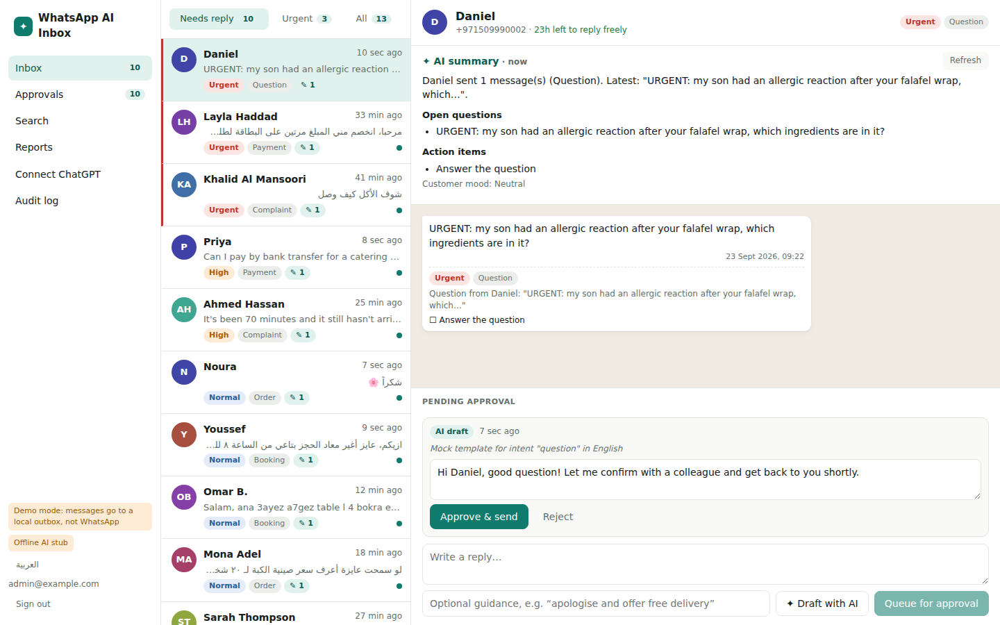
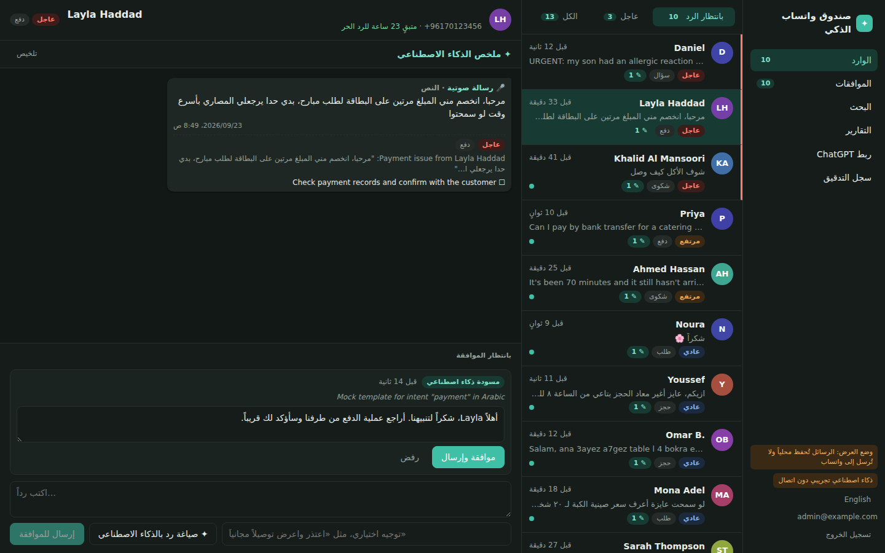
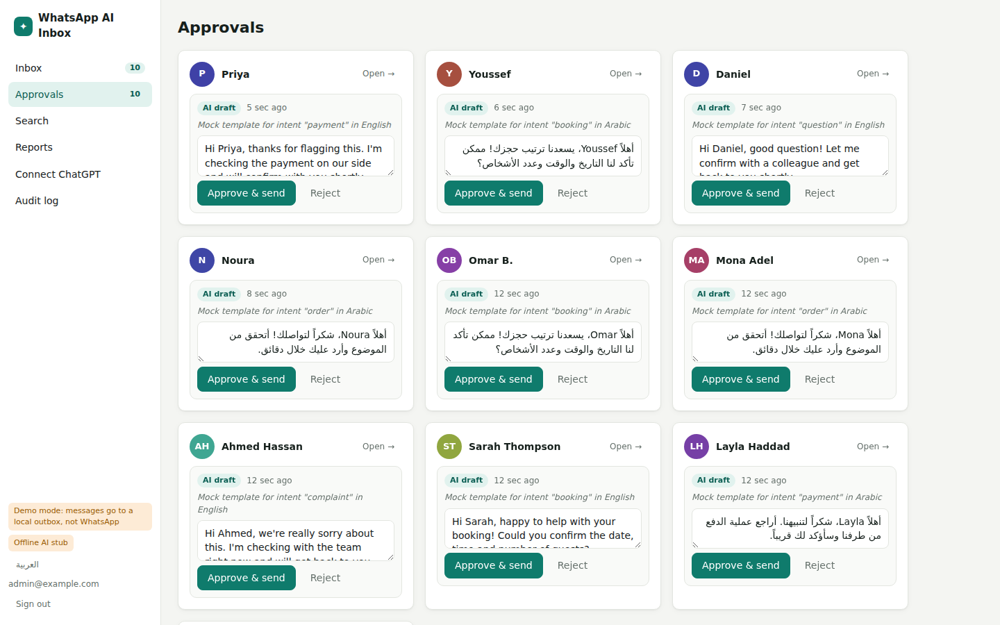
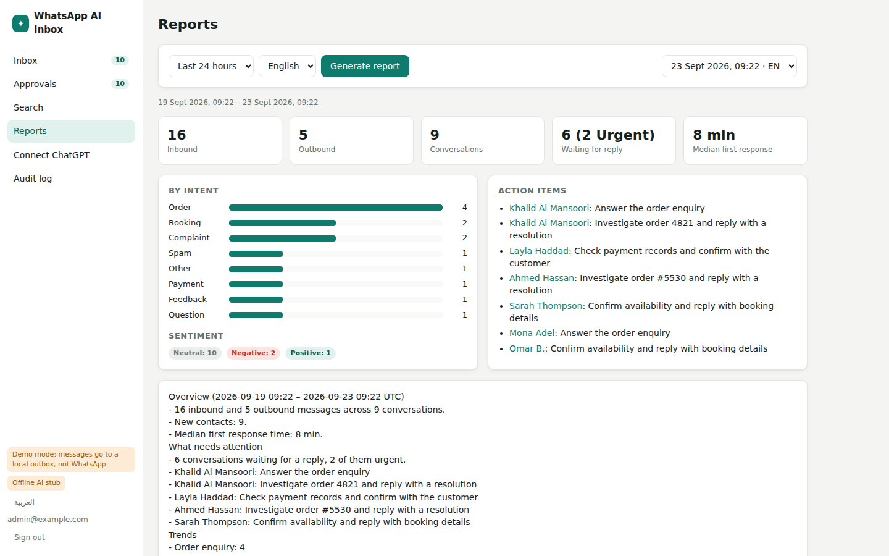
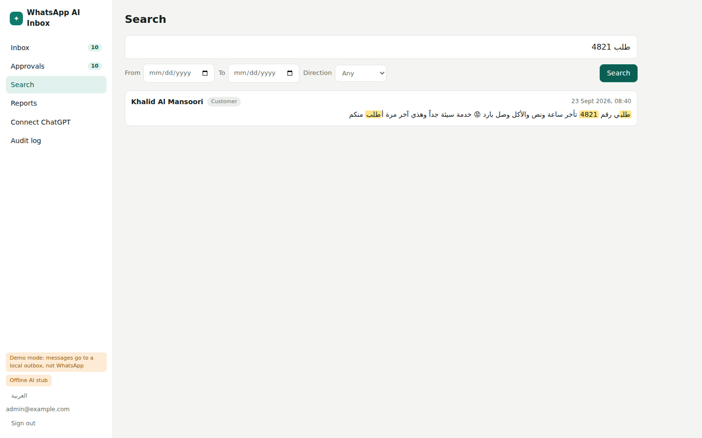
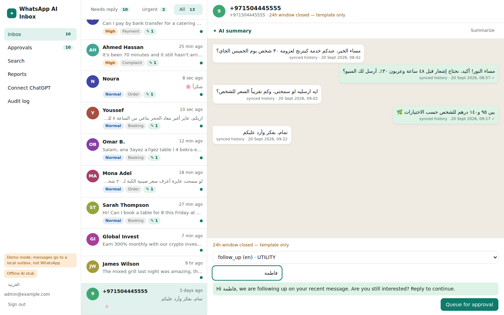
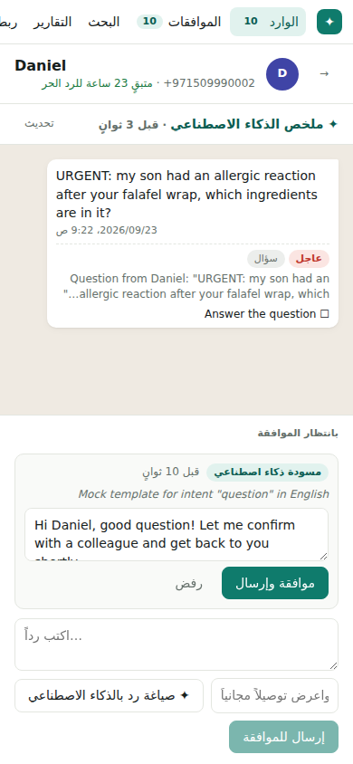

# WhatsApp Business × OpenAI: AI inbox with human approval

Connects a WhatsApp Business number (official **Meta Cloud API**) to **OpenAI** and **ChatGPT**:

- **Triage every incoming message:** priority, *needs reply?*, intent, sentiment, language, action items. Works in English, Arabic dialects and Arabizi, and transcribes voice notes.
- **Search and summarize** all chats. Search is Arabic-aware (hamza, taa-marbuta and digit variants) and semantic, so "late order" finds «الطلب متأخر».
- **Reports** (daily or on demand) in English or Arabic.
- **AI-drafted replies** in the customer's dialect, **sent only after a person approves**, with the 24-hour window and templates enforced.
- **ChatGPT / Claude via MCP:** *"who's waiting for a reply?"*, *"summarize Khalid's chat in Arabic"*, *"draft an apology to +971…"*. Messages prepared this way land in the approval queue.
- **Coexistence ready:** replies typed on the phone app and synced history are ingested. WhatsApp "Export chat" files can be imported for older chats.



| Arabic, RTL, dark | Approval queue | Reports |
|---|---|---|
|  |  |  |
| **Hybrid search** | **24h window closed → template** | **Mobile** |
|  |  |  |

The analysis of the client brief is in **[docs/PROPOSAL.md](docs/PROPOSAL.md)**. It covers keeping the number, existing chats and groups, architecture, Arabic, costs and limitations. See also [ARCHITECTURE.md](docs/ARCHITECTURE.md) and [SECURITY.md](docs/SECURITY.md).

## Quick start (demo mode, no credentials)

Requires Node ≥ 22.18, pnpm, and Postgres 16 with pgvector (or Docker).

```bash
pnpm install
cp .env.example .env                    # WA_MODE=mock, AI_PROVIDER=mock by default
docker compose up -d db                 # or point DATABASE_URL at your own Postgres + pgvector
pnpm --filter @wa/web build             # dashboard is served by the API server
pnpm seed --reset                       # demo conversations in EN / Gulf / Egyptian / Levantine Arabic / Arabizi
pnpm --filter @wa/server dev            # http://localhost:3000  (login = ADMIN_EMAIL / ADMIN_PASSWORD)
pnpm simulate                           # in another terminal: signed webhooks arrive live
```

In demo mode nothing leaves your machine:
- "sent" messages go to the `mock_outbox` table;
- the AI is a deterministic keyword stub.

Set `AI_PROVIDER=openai` and `OPENAI_API_KEY` to use real models. The rest of the flow stays the same.

For dashboard development with hot reload, run `pnpm --filter @wa/web dev` (port 5173, proxies `/api` to 3000).

Or run everything in containers: `docker compose up --build`.

## Going live with Meta

1. Create a Meta app (type *Business*), add **WhatsApp**, and link your Business Portfolio.
2. Add your number. You can use Meta's free **test number** first. For an existing Business App number, use **Embedded Signup with coexistence**, or migrate it.
3. Create a **system user** token with `whatsapp_business_messaging` and `whatsapp_business_management`.
4. Set in `.env`:
   - `WA_MODE=live`
   - `WA_PHONE_NUMBER_ID`, `WA_BUSINESS_ACCOUNT_ID`
   - `WA_ACCESS_TOKEN`, `WA_APP_SECRET`
   - `WA_VERIFY_TOKEN` (any string)
   - `PUBLIC_URL` (https)
5. Webhook: callback `https://<your-host>/webhook`, verify token = `WA_VERIFY_TOKEN`. Subscribe to `messages`, plus `smb_message_echoes` and `history` if you use coexistence.
6. Put your policies, hours and tone in a Markdown file and set `BUSINESS_PROFILE_FILE`. Drafts only use facts from it.

## Connect ChatGPT

In the dashboard, open **Connect ChatGPT → Create token**, then:

- **ChatGPT** (Settings → Connectors → developer mode → Create): URL `https://<host>/mcp/<token>`, authentication *None*.
- **Claude / MCP Inspector / OpenAI Responses API:** URL `https://<host>/mcp` with header `Authorization: Bearer <token>`.

| Tool | Scope | Effect |
|---|---|---|
| `search_messages` | read | hybrid search with phone/date filters |
| `list_conversations` | read | reply queue sorted by urgency |
| `get_conversation` | read | messages + triage + drafts + 24h window state |
| `summarize_conversation` | read | summary, open questions, action items, mood (EN/AR) |
| `generate_report` | read | stats + written report for a period |
| `list_templates` | read | approved templates |
| `draft_reply` | draft | AI draft (optionally steered) → approval queue |
| `request_send` | draft | exact text or template → approval queue (new numbers need a template) |

No tool can send a message. Approval happens in the dashboard.

## Import old chats

```bash
pnpm import-chat --file "WhatsApp Chat with Ali.txt" --phone +971501234567 --me "Zaatar & Co."
```

Handles Android and iOS exports, Arabic-locale dates (٣١/١٢/٢٠٢٥، ٩:١٥ م) and multi-line messages. Imports are idempotent.

## Development

```bash
pnpm typecheck && pnpm lint && pnpm test   # tests need Postgres: TEST_DATABASE_URL (default postgres://wa:wa@localhost:5432/wa_test)
```

- **51 tests:**
  - signature verification, webhook normalization (text, voice, image, location, status, echo, history);
  - Arabic normalization and Arabizi detection;
  - chat-export parsing;
  - the full inbound pipeline;
  - approval state machine and 24h rule, roles;
  - hybrid search (Arabic variants, Arabic-Indic digits, transcripts);
  - reports;
  - MCP tools over real HTTP with an MCP client.
- CI: `.github/workflows/ci.yml` (Postgres + pgvector service).

## Stack

Node 22 + TypeScript (run natively, no build step) · Fastify · Postgres 16 + pgvector · pg-boss · OpenAI SDK (Responses API, structured outputs, embeddings, transcription) · MCP TypeScript SDK · React 19 + Vite.
