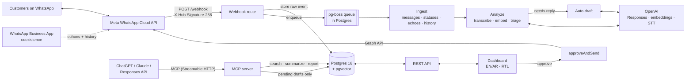

# Architecture



## Request path of an inbound message

1. **`POST /webhook`** (`apps/server/src/whatsapp/routes.ts`) verifies the HMAC over the *raw* bytes, stores the payload in `webhook_events`, enqueues `webhook.process` and returns 200. This keeps latency low, and Meta retries on non-2xx responses.
2. **`processWebhookEvent`** (`services/ingest.ts`) normalizes the payload (`whatsapp/normalize.ts`):
   - messages, statuses, `smb_message_echoes` and `history`;
   - upserts contact and conversation;
   - inserts messages idempotently on `wa_message_id`;
   - applies statuses without regressing (read never goes back to delivered).
3. **`analyzeMessage`** (`services/analyze.ts`):
   - downloads and transcribes voice notes;
   - embeds the text for search;
   - for live inbound messages, calls the model for a structured **triage** (`TriageSchema` in `packages/shared`);
   - updates the conversation flags: a conversation keeps its most severe priority until someone replies;
   - supersedes stale, unedited AI drafts and queues a fresh draft.
4. The dashboard polls. Staff edit, approve or reject drafts. **`approveAndSend`** (`services/drafts.ts`):
   - is the only caller of `WhatsAppClient.send*`;
   - locks the draft;
   - enforces the 24h window for free-form text;
   - sends, records the outbound message and audits every step.

## Components

| Path | What |
|---|---|
| `packages/shared` | Arabic normalization / script detection, zod schemas, API DTO types |
| `apps/server/src/whatsapp` | Signature check, payload normalization, Graph API client + mock client |
| `apps/server/src/ai` | Provider interface, OpenAI implementation (structured outputs), deterministic offline mock, prompts |
| `apps/server/src/services` | Ingest, analyze, drafts/approvals, search, summaries, reports, templates, auth, audit, retention, chat-export import |
| `apps/server/src/mcp` | MCP server (stateless Streamable HTTP), bearer or secret-URL auth |
| `apps/server/src/api` | Dashboard REST API (session cookie + CSRF header) |
| `apps/server/migrations` | Plain SQL migrations (generated tsvector, HNSW index) |
| `apps/web` | React dashboard: inbox, approvals, search, reports, MCP tokens, audit |

## Design decisions

- **Postgres for everything** (data, vector search, full-text search, job queue). One stateful dependency to run and back up. `pg-boss` provides retries with backoff; pgvector plus a generated `tsvector` column combining the `simple`, `arabic` and `english` configurations provide hybrid search.
- **Hybrid search with reciprocal rank fusion.** Full-text search is best for order numbers and names. Embeddings are best for paraphrases and cross-language matches. RRF merges the two rankings without tuning weights.
- **Arabic normalization at write time** (`text_normalized`), so indexes stay simple and the original text is shown unchanged.
- **Stateless MCP.** A new server and transport per request, so the app scales horizontally without sticky sessions.
- **Mock providers** (`WA_MODE=mock`, `AI_PROVIDER=mock`) that exercise the same code paths. The demo and the test suite run with no credentials. Switching to live mode is configuration only.
- **No build step on the server.** Node ≥ 22.18 strips TypeScript types natively, so `node src/main.ts` runs in dev and prod. The code uses only erasable syntax (`erasableSyntaxOnly`).

## Data model (short)

```
contacts 1─1 conversations 1─* messages 1─0..1 message_analyses
                         1─* drafts ─0..1▶ messages (sent_message_id)
                         1─0..1 conversation_summaries
users 1─* sessions, api_tokens      audit_log · reports · templates · webhook_events · mock_outbox
```
